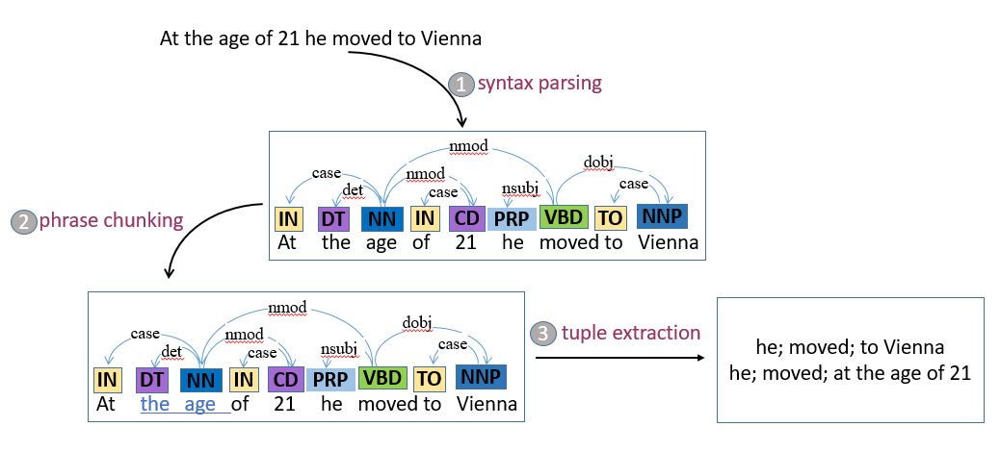

# Building predicate-centric context-rich knolwedge graphs from raw text documents

## Introduction

### Motivation
Knolwdge graphs have drawn much attentions in recentyears. Knolwedge graphs have been applied widely. At the present, there're some public knolwedge graphs, such as wikidata and DBpedia. Both of them are built based on wikipedia. Knolwedges such as entity attributes and entity relations are extracted from semi-structured information, such as inforbox. Though these knowledge grahs are large, a lot of information recorded in wikipedia is missing due to the limitation of semi-structured information in wikipedia. To tackle with this issue, we need to extract useful information from raw text documents in wikipedia. Thus, there's no doubt that it's very important to develop the technology to extract information from raw text.

### Example
The knowledge built from the following text is illustrated in figure1.

Beethoven was born in Bonn, the capital of the Electorate of Cologne and part of the Holy Roman Empire.At the age of 21 he moved to Vienna, where he began studying composition with Joseph Haydn.

 
figure1. knowledge graph example.

### Characteristics of the built knolwedge graph
- predicate-centric representation

  Predicates are represented as nodes and an edge starts with a predicate and ends with a noun phrase.
  In this way, n-ary relations can be represented with traditional knowledge graph repsentation.

- canonicalized noun phrases

  Noun phrases are linked to the entities in an existing knolwedge graph so that different names of the same entity can be detected.

- context-rich

  Unlike traditional (subject; predicate; object) facts, adverbials that provide useful information like address, time are extracted. These adverbials act as the context of the facts so they need to be extracted.

### Applications
- generating assertions

  Assertions (facts) can be generated with the extacted tuples.

- document representation

  The built knolwedge graph can act as graph-based representation of the document. And it can be used to do document comparision and train the document embedding.

- document summarization

  The extracted tuples ( or the knowledge graph ) can act as the summarization of the documents.

## Approach

### Pipline

The procedure of the knowledge graph building is illustrated in figure2.

 
figure2. The procedure of knolwedge graph building

#### 1.Syntax Parsing

 Parsing the sentences with dependency parser.

#### 2. Phrase Chunking

 Recognizing noun and verb phrases.

#### 3. Tuple extraction

 Tuples are extracted according to syntatic rules. At first, defifferent clauses are detected. Then tuples are extracted according to the clause type.

  Basic clauses:

| clause type | example | extractions |
|-------------|---------|------------|
| SV | Beethoven moved. |Beethoven; moved; |
|SVP | Beethoven was a composer. |Beethoven; be; a composer|
|SVO | Beethoven began studying composition.|Beethoven; began studying; composition|
|SVOO| Beethoven played him a piece of music.|Beethoven; play; a piece of music  Bethoven; play; him|
|SVC |  Beethoven died yough.| Beethoven; died;|

 Clauses with adverbials:

| clause type | example | extractions |
|-------------|---------|------------|
|SVA|Bethoven moved to Viena.|Beethoven; moved; to Viena|
|SVPA|Beethoven was a child in 1999.|Beethoven; be; a child   Beethoven; be; in 1776|
|SVOA|Beethoven began studying composition with Joseph Haydn.|Beethoven; began studying; composition  Beethoven; began studying; with Joseph Haydn|
|SVOOA|Beethoven Beethoven played him a piece of music in 1796.|Beethoven; play; a piece of music   Beethoven; play; him  Beethoven; play; in 1796|

Figure3 shows a running example of the above steps.

 
figure3. a running example

#### 4.Tuple Refinement

 Corefence are detected.

#### 5.Constructing Graph

 Constructing the graph with the extracted tuples.

#### 6.Entity Linking

 Noun phrases are linked to the corresponding entities in Dbpedia so that they are canonicalized.

### sentence simplification

to be continued

### collistion resolution

to be continued
